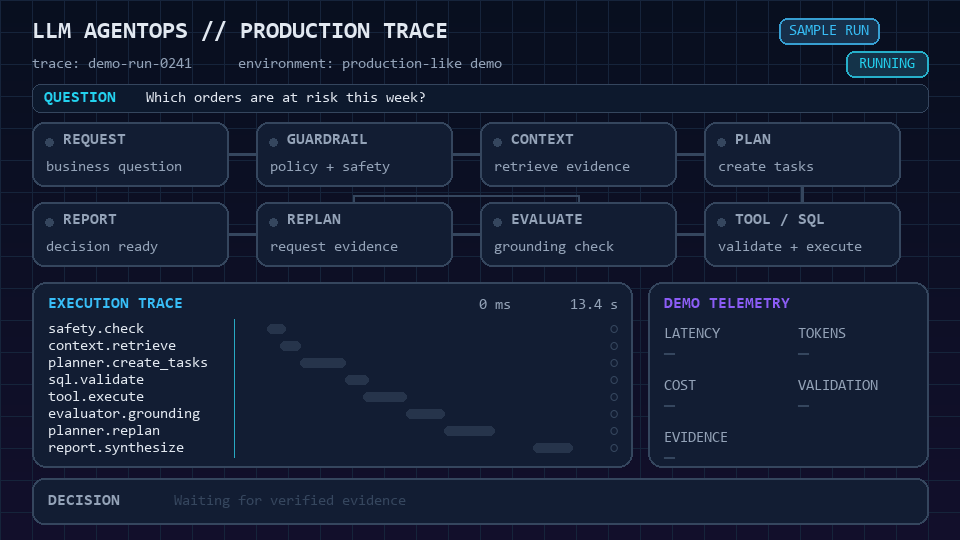

  <a href="./README.md">English</a> |
  <a href="./README.ko.md">한국어</a>

  

<h1 align="center">백승준 · Sung Jun "Tony" Baek</h1>

<strong>LLM AgentOps 엔지니어</strong>

  

  
  
  

  

저는 **LLM AgentOps**를 중심으로 에이전트 프로토타입을 관측 가능하고,
테스트 가능하며, 비용을 추적할 수 있는 안정적인 운영 시스템으로
전환합니다. 동시에 금융 거래, 제조 APS, 물류창고 디지털 트윈처럼 높은
데이터 정합성과 가용성이 요구되는 미션 크리티컬 플랫폼을 설계하고
운영해 왔습니다.

## 에이전트 하네싱 및 워크플로 엔지니어링

> Claude와 Codex 기반 에이전트 하네스를 설계해 개방형 개발 작업을 통제
> 가능하고 반복 가능하며 검토 가능한 엔지니어링 워크플로로 전환합니다.

- 역할별 프롬프트, 컨텍스트, 작업 범위를 분리해 각 에이전트에 필요한
  정보와 권한만 제공합니다.
- 저장소, 브라우저, 문서, 배포 작업의 도구 권한과 통제된 실행 경로를
  관리합니다.
- 계획 → 구현 → 테스트 → 리뷰 → PR 워크플로를 명시적인 체크포인트와
  복구 경로로 오케스트레이션합니다.
- 검증 게이트, 추적 가능한 결과물, 명시적 작업 인계를 통해 실행 결과의
  재현성과 감사 가능성을 높입니다.
- 독립 검증이 필요한 작업은 구현과 리뷰 역할을 분리해 결과의 신뢰도를
  높입니다.

## Symphony — APS 분석을 위한 LLM AgentOps

> 자연어 기반 APS 분석을 계획, 실행, 검증, 재계획할 수 있도록 구성하고
> 전체 에이전트 실행 과정을 운영 관점에서 추적하는 프로덕션 AI 플랫폼입니다.

- 계획 수립, SQL 보조 분석, 실행 결과 평가, 재계획, 보고서 생성을 연결한
  다단계 에이전트 워크플로를 개발하고 개선했습니다.
- LLM 실행 경로를 중앙화해 런타임 컨텍스트, 토큰 사용량, 추론 트레이스,
  비용 신호를 일관되게 수집할 수 있도록 구성했습니다.
- 프롬프트 인젝션, 실행 컨텍스트, SQL 도구에 대한 회귀 테스트를 추가해
  리팩터링 과정에서도 에이전트 동작을 보호했습니다.
- Prometheus와 Grafana를 활용해 에이전트, API, 데이터베이스, 모델, 세션,
  도구 계층의 운영 지표와 추적 가능성을 확장했습니다.
- 사용량 리포팅과 보호된 API 문서 접근 등 운영 통제 기능을 구현했습니다.

## Taelim — 제조 APS 및 스케줄링 엔진

> 골판지 포장 제조 현장의 주문 할당, 설비 스케줄링, 로트 구성을 지원하는
> 제조 계획 엔진입니다.

- 로트 구성 과정에서 오래된 수요가 중복 처리되는 문제를 방지했습니다.
- 확정 주문 재구성 흐름을 수정해 조건을 충족한 주문이 공장별 계획에서
  누락되지 않도록 개선했습니다.
- 코팅 도메인 규칙을 리팩터링하고 재공품 및 주문 길이 데이터의 정합성을
  강화했습니다.
- 단위 테스트, 통합 데이터 세트, GitHub Actions를 통해 반복 가능한 품질
  검증 체계를 구축했습니다.
- Oracle 스키마·인덱스 버전 관리, 설정 가능한 로깅, 엔진 결과 내보내기를
  통해 운영 지원 기능을 개선했습니다.

## 추가 플랫폼 경력

### 금융 서비스 플랫폼 — 실시간 펀드 처리

> **BeaconFire Inc.** 백엔드 개발자로서 고가용성과 데이터 정합성이 필요한
> 실시간 펀드 처리 및 거래 데이터 검증 시스템을 개발했습니다.

- 파티션 인덱스와 스트림 기반 조회를 적용해 100만 건 데이터 조회 시간을
  60초에서 2초로 단축했습니다.
- Actuator Health Check과 Servlet Executor를 도입해 Kubernetes Liveness
  Probe의 불필요한 재시작을 제거하고 헬스 체크 실패를 시간당 40건에서
  0건으로 감소시켰습니다.
- Kafka, AMQ/RabbitMQ, Kinesis 기반 이벤트 처리 흐름을 구축하고 DynamoDB,
  PostgreSQL, Azure SQL을 연계한 동기·비동기 마이크로서비스를 개발했습니다.
- 레거시 코드를 주문 관리 시스템으로 재구성하고 대규모 배치 처리에 캐싱,
  인덱싱, 낙관적 잠금을 적용해 성능과 데이터 일관성을 강화했습니다.
- Docker, JOOQ, Flyway 기반 테스트 환경에서 JUnit 5와 TDD를 적용해 실제
  데이터와 격리된 반복 가능한 배포 검증 체계를 구축했습니다.

### 물류창고 디지털 트윈 서비스 플랫폼

> **VisionSpace**에서 풀스택 엔지니어로 근무하며 AI 플랫폼 개발을
> 리딩했고, 물류창고 설비 데이터를 실시간 수집·시각화·분석하는
> 하이브리드 클라우드 플랫폼을 개발했습니다.

- 온프레미스와 AWS를 연결하는 Java/Spring Boot 마이크로서비스를 설계하고
  ECR, ECS, Fargate 기반 컨테이너 운영 환경을 구축했습니다.
- AWS IoT Core 실시간 파이프라인에 오토스케일링을 적용해 초당 5,000개
  이상의 메시지를 안정적으로 처리했습니다.
- Jenkins 파이프라인으로 환경별 테스트와 배포를 자동화해 배포 시간을
  3시간에서 15분으로 단축했습니다.
- React/TypeScript 기반 UI와 웹 애플리케이션 서버를 개발해 동적 디지털
  트윈 시뮬레이션을 시각화하고 제어할 수 있도록 구현했습니다.
- .NET/C# 비동기 부하 도구로 MQTT·WebSocket·AWS IoT 로봇 장비 신호를
  모사하고 고동시성 환경에서 플랫폼 성능을 검증했습니다.
- LLM, RAG, VectorDB, 프롬프트 엔지니어링, 컴퓨터 비전을 통합해 현장
  데이터를 자연어로 분석하고 검색할 수 있는 AI 워크플로를 구현했습니다.

## 기술 역량

| LLM AgentOps | 백엔드 및 이벤트 시스템 |
| --- | --- |
| Claude · Codex · 에이전트 하네싱 · 워크플로 오케스트레이션 · 컨텍스트 엔지니어링 · 검증 게이트 · LLM 워크플로 · RAG · VectorDB · 런타임 트레이스 | Python · FastAPI · Java · Spring Boot · Kafka · RabbitMQ · Kinesis · PostgreSQL |

| 관측 가능성 및 클라우드 운영 | 디지털 트윈 및 제조 |
| --- | --- |
| Prometheus · Grafana · Jenkins · Docker · Kubernetes/OpenShift · AWS · Azure | MQTT · WebSocket · AWS IoT · React · TypeScript · Oracle · APS 스케줄링 |

## 이전 엔지니어링 경험

- **대한민국 해군 전산·통신 및 IT 인프라** — Windows와 Ubuntu 서버,
  네트워크 계층을 운영하고 Java 8, Java Swing, Mail API를 활용한 행정
  지원 프로그램을 개발했습니다.
- **Robolink 임베디드 로봇 개발 인턴** — C 기반 센서 데이터 처리와 모터
  제어, UART·Zigbee 통신, 타이머·인터럽트를 활용한 휴머노이드 로봇 제어
  개발과 테스트를 지원했습니다.
- [ModelTranslator](https://github.com/TCC2021SeniorProject/ModelTranslator) —
  UPPAAL 상태 머신 모델을 임베디드 장치용 Python 코드로 변환하는
  모델 기반 IoT 도구입니다.
- [Hibernate 퀴즈 웹 애플리케이션](https://github.com/MarcoBackman/hibernate_quiz_webapp) —
  Spring Boot와 Hibernate 기반 관계형 데이터 및 보호 경로 처리 프로젝트입니다.
- [D* 알고리즘](https://github.com/MarcoBackman/d-star-algorithm) —
  Python/Pygame과 Java 데스크톱 UI로 구현한 경로 탐색 프로젝트입니다.

## 학력 및 자격

- **Florida Institute of Technology** — 컴퓨터과학 학사
- **SQL 개발자(SQLD)** — 한국데이터산업진흥원
- **데이터아키텍처 준전문가(DAsP)** — 한국데이터산업진흥원
- **네트워크관리사 2급** — 한국정보통신자격협회
- **MS 365 Fundamentals** — Microsoft
- **OPIc AL**

## 공개 GitHub 활동

  
  

  

  

